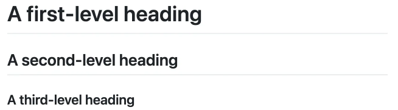
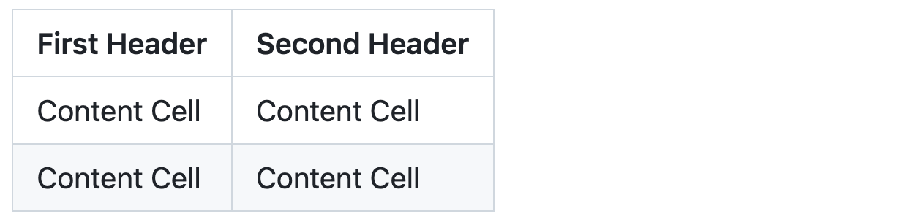
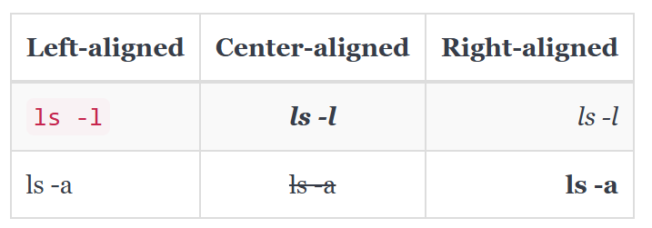
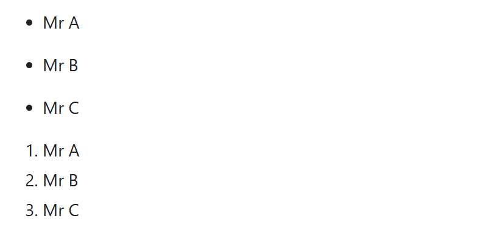
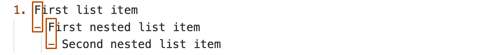
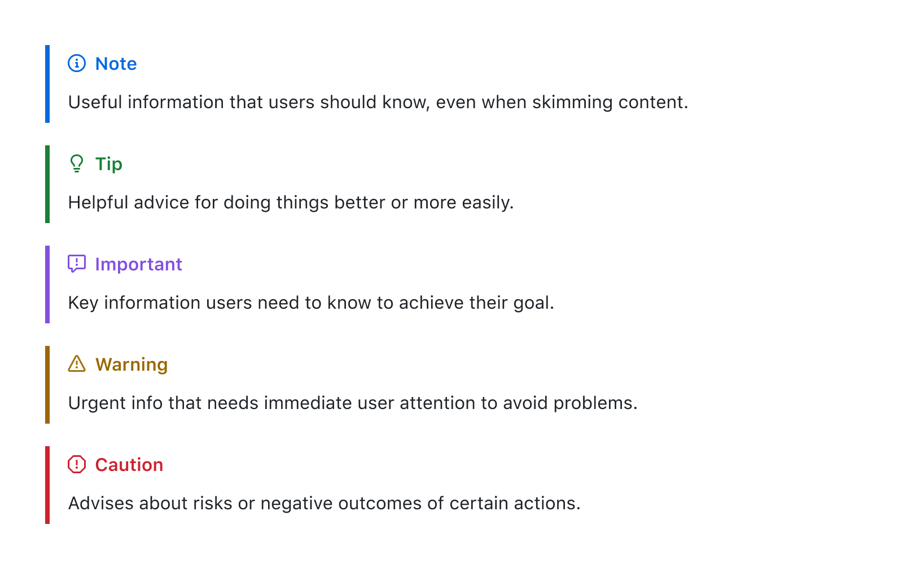
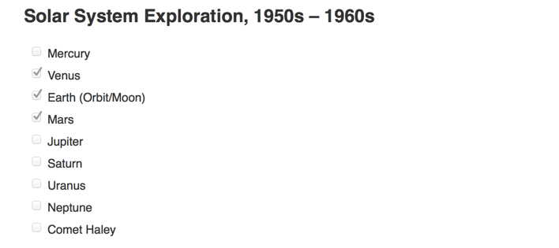

# Introduction 

## Markdown basic writing and formatting syntax

Markdown is a plain text format for writing structured documents, based on conventions for indicating formatting in email and usenet posts. It was developed by John Gruber (with help from Aaron Swartz) and released in 2004. In the next decade, dozens of implementations were developed in many languages. 

Markdown is an easy-to-read, easy-to-write language for formatting plain text. Websites like Reddit, StackOverflow, and GitHub had millions of people using Markdown. And Markdown started to be used beyond the web, to author books, articles, slide shows, letters, and lecture notes.

In this guide, you'll learn some basic/advanced formatting features by creating or editing a markdown file.

## Headings
To create a heading, add one to six <kbd>#</kbd> symbols before your heading text. The number of <kbd>#</kbd> you use will determine the hierarchy level and typeface size of the heading.

```markdown
# A first-level heading
## A second-level heading
### A third-level heading
```



## Creating a table
You can create tables with pipes `|` and hyphens `-`. Hyphens are used to create each column's header, while pipes separate each column. You must include a blank line before your table in order for it to correctly render.

```markdown

| First Header  | Second Header |
| ------------- | ------------- |
| Content Cell  | Content Cell  |
| Content Cell  | Content Cell  |
```



The pipes on either end of the table are optional.

Cells can vary in width and do not need to be perfectly aligned within columns. There must be at least three hyphens in each column of the header row. 

Markdown table with the commands formatted as code blocks. Bold and italic formatting are used in the descriptions

You can align text to the left, right, or center of a column by including colons `:` to the left, right, or on both sides of the hyphens within the header row.


```markdown
| Left-aligned | Center-aligned | Right-aligned |
| :--- |            :-:      |                 -----: |
| `ls -l`   | ***ls -l***    | _ls -l_    |
| ls -a     | ~~ls -a~~        | **ls -a**       |
```



## Styling text
You can indicate emphasis with bold, italic, strikethrough, subscript, or superscript text in comment fields and `.md` files.

| Style                  | Syntax                | Example                                  | Output                                    |
| ---------------------- | --------------------- | ---------------------------------------- | ----------------------------------------- |
| Bold                   | `** **` or `__ __`    | `**This is bold text**`                  | **This is bold text**                     |
| Italic                 | `* *` or `_ _`        | `_This text is italicized_`              | _This text is italicized_                 |
| Strikethrough          | `~~ ~~` or `~ ~`      | `~~This was mistaken text~~`             | ~~This was mistaken text~~                |
| Bold and nested italic | `** **` and `_ _`     | `**This text is _extremely_ important**` | **This text is _extremely_ important**    |
| All bold and italic    | `*** ***`             | `***All this text is important***`       | ***All this text is important***          |
| Underline              | `<ins> </ins>`        | `This is an <ins>underlined</ins> text`  | This is an <ins>underlined</ins> text     |
| Inline code            | `` ` ` `` (single `)  | `` `systemctl status nginx` ``           | `systemctl status nginx`                  |

## Code blocks (triple backticks)
To format code or text into its own distinct block, use triple backticks.
Use triple backticks to format commands or config as a standalone block.  
You can add a language hint for syntax highlighting (e.g.,`shell`, `bash`, `yaml`,`console`, ...).

**Ansible playbook example:**

````markdown
```yaml
- name: Ensure Nginx is installed
    apt:
    name: nginx
    state: present
    update_cache: true

- name: Ensure Nginx is enabled and running
    service:
    name: nginx
    state: started
    enabled: true
```
````

**Linux example:**

````markdown
```shell
# Update packages (Debian/Ubuntu)
sudo apt update && sudo apt upgrade -y

# Check disk usage
df -h
```
````

Here are the rendered : 

```yaml
- name: Ensure Nginx is installed
    apt:
    name: nginx
    state: present
    update_cache: true

- name: Ensure Nginx is enabled and running
    service:
    name: nginx
    state: started
    enabled: true
```

```shell
# Update packages (Debian/Ubuntu)
sudo apt update && sudo apt upgrade -y

# Check disk usage
df -h
```

## Quoting text
You can quote text with a <kbd>></kbd>.

```markdown
Text that is not a quote

> Text that is a quote
```

Quoted text is indented with a vertical line on the left and displayed using gray type.


## Lists
You can make an unordered list by preceding one or more lines of text with <kbd>-</kbd>, <kbd>*</kbd>, or <kbd>+</kbd>.

```markdown
- Mr A
* Mr B
+ Mr C
```



To order your list, precede each line with a number.

```markdown
1. Mr A
2. Mr B
3. Mr C
```

### Nested Lists
You can create a nested list by indenting one or more list items below another item.

Type space characters in front of your nested list item until the list marker character (<kbd>-</kbd> or <kbd>*</kbd>) lies directly below the first character of the text in the item above it.

```markdown
1. First list item
   - First nested list item
     - Second nested list item
```



> [!NOTE]
> In the web-based editor, you can indent or dedent one or more lines of text by first highlighting the desired lines and then using <kbd>Tab</kbd> or <kbd>Shift</kbd>+<kbd>Tab</kbd> respectively.


In this example, you could add a nested list item under the list item `100. First list item` by indenting the nested list item a minimum of five spaces, since there are five characters (`100. `) before `First list item`.

```markdown
100. First list item
     - First nested list item
```


You can create multiple levels of nested lists using the same method. For example, because the first nested list item has seven characters (`␣␣␣␣␣-␣`) before the nested list content `First nested list item`, you would need to indent the second nested list item by at least two more characters (nine spaces minimum).

```markdown
100. First list item
     - First nested list item
       - Second nested list item
```


## Alerts
Alerts are a Markdown extension based on the blockquote syntax that you can use to emphasize critical information. They are displayed with distinctive colors and icons to indicate the significance of the content.

Additionally, you should avoid placing alerts consecutively. Alerts cannot be nested within other elements.

To add an alert, use a special blockquote line specifying the alert type, followed by the alert information in a standard blockquote. Five types of alerts are available:

```markdown
> [!NOTE]
> Useful information that users should know, even when skimming content.

> [!TIP]
> Helpful advice for doing things better or more easily.

> [!IMPORTANT]
> Key information users need to know to achieve their goal.

> [!WARNING]
> Urgent info that needs immediate user attention to avoid problems.

> [!CAUTION]
> Advises about risks or negative outcomes of certain actions.
```

Here are the rendered alerts:



## Task lists
Task lists are incredibly useful for project coordination and keeping track of important items. Starting today, we are adding read-only task lists to all Markdown documents in repositories and wikis. So now, when you write:

```markdown
### Solar System Exploration, 1950s – 1960s

- [ ] Mercury
- [x] Venus
- [x] Earth (Orbit/Moon)
- [x] Mars
- [ ] Jupiter
- [ ] Saturn
- [ ] Uranus
- [ ] Neptune
- [ ] Comet Haley
```

Edit the document page and use the `- [ ]` and `- [x]` syntax to update your task list.

It will render like this:



## Images
You can display an image by adding <kbd>!</kbd> and wrapping the alt text in `[ ]`. Alt text is a short text equivalent of the information in the image. Then, wrap the link for the image in parentheses `()`.

``


You can display an image from your repository, add a link to an online image, or upload an image.

> [!NOTE]
> When you want to display an image that is in your repository, use relative links instead of absolute links.

## Creating a collapsed section

You can temporarily obscure sections of your Markdown by creating a collapsed section that the reader can choose to expand. 

The Markdown inside the `<summary>` label will be collapsed by default and after a reader `Click` , the details are expanded:

<details>
  <summary>Click</summary>

  ### Heading
  1. Foo
  2. Bar
     * Foo
     * Bar

  ### Some Ansible Task
  ```yaml
- name: Ensure Nginx is installed
    apt:
    name: nginx
    state: present
    update_cache: true
  ```
</details>

---

For example : The collapsed section contains headers, text, and code blocks.

````markdown
<details>
  <summary>Click me</summary>

  ### Heading
  1. Foo
  2. Bar
     * Foo
     * Bar

  ### Some Ansible Task
  ```yaml
- name: Ensure Nginx is installed
    apt:
    name: nginx
    state: present
    update_cache: true
  ```
</details>
````